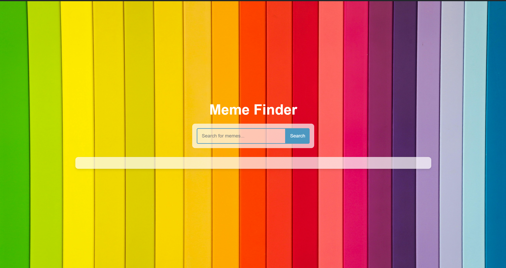

# Meme Finder

Meme Finder is a web application that allows users to search for memes using the Giphy API. It provides a simple and intuitive interface to discover and display memes based on user queries.



## Features

- **Search Functionality:** Enter a keyword to search for related memes.
- **Display:** Memes are displayed in a responsive grid layout.
- **Interactive:** Click on any meme to view it in full size on Giphy.

## Demo

Check out the live demo [here](https://your-demo-url.com).

## Technologies Used

- HTML
- CSS
- JavaScript
- Giphy API


## Installation

To use Meme Finder locally:

1. Clone the repository:
   ```bash
   git clone https://github.com/your-username/meme-finder.git
